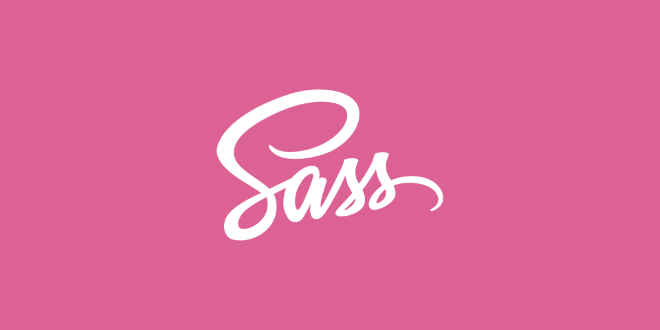

# Azion Theme



The Azion Theme repository is focused on sharing our style kit across interfaces and should be used in all company projects, including Azion Console Kit, Azion Site, Landing Pages, and all user interactions with Azion.


## How to install

To install the Azion Theme, you can use the following command:

``` bash
npm install azion-theme
```

``` bash
yarn add azion-theme
```

Alternatively, you can configure the package.json file by adding the dependency:

``` json
{
    "dependencies": {
        "azion-theme": "ˆ1.4.0"
    }
}
```

After updating the package.json file, run npm install in the root of your project to install the Azion Theme.


### How to Integrate into a Front-End Project

To integrate the Azion Theme into your front-end project, you need to import the theme files in your project's entry point file (App.vue, main.js, index.js, etc.):

``` javascript
import 'azion-theme/dark';
import 'azion-theme/light';
```

Make sure to include these imports at the top of your entry point file to ensure the styles are applied correctly throughout your application.


## How to work to develop

To work locally, you should clone both the `azion-theme` repository and the other repository where `azion-theme` will be used.

### Example:
In this example, we will use the [azion-webkit](https://github.com/aziontech/webkit) repository:

1. Clone the `azion-webkit` and `azion-theme` repositories:
  ```bash
   git clone https://github.com/aziontech/webkit.git
   git clone https://github.com/aziontech/azion-theme.git
  ```

2. Install dependecies and create a link point
  ```bash
    cd azion-theme
    npm install
    npm link
  ```

3. Link the `azion-theme` to the `azion-webkit` project:
```bash
  cd ../azion-webkit
  npm install
  npm link azion-theme
```

4. Run the development server:
  ```bash
    npm run dev
  ```

Any modifications made to `azion-theme` will be reflected on this development server with hot reload.
