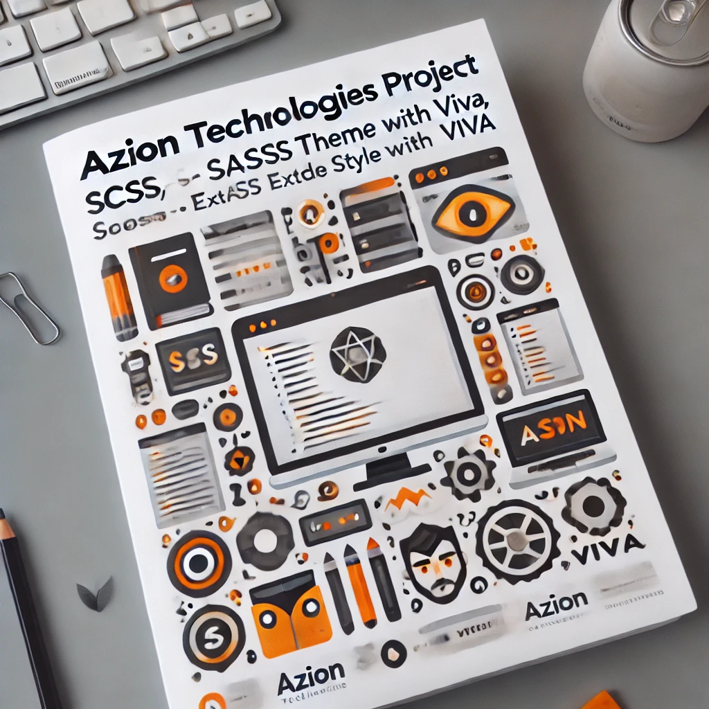

<h1 align="center">azion-theme</h1>


<p align="center">
    
</p>

The Azion Theme repository is focused on sharing our style kit across interfaces and should be used in all company projects, including Azion Console Kit, Azion Site, Landing Pages, and all user interactions with Azion.

## Easy to Install

To install the `azion-theme` project, you need to follow the command. Choose one of your preferences: npm or yarn:

```bash
npm install azion-theme --save
# or
yarn add azion-theme
```

Alternatively, you can configure the `package.json` file by adding the dependency:

```json
{
  "dependencies": {
    "azion-theme": "^1.4.0"
  }
}
```

After updating the `package.json` file, run `npm install` in the root of your project to install the Azion Theme.

### Easy to Connect with Front-End Project

To integrate the Azion Theme into your front-end project, you need to import the theme files in your project's entry point file (App.vue, main.js, index.js, etc.):

```javascript
import 'azion-theme/dark';
import 'azion-theme/light';
```

Make sure to include these imports at the top of your entry point file to ensure the styles are applied correctly throughout your application.

## How to Develop Locally

To work locally, you should clone both the `azion-theme` repository and the other repository where the theme will be used.

### Example:

In this example, we will use the [azion-webkit](https://github.com/aziontech/azion-webkit) repository:

1. Clone the `azion-webkit` and `azion-theme` repositories:
  
  ```bash
  git clone https://github.com/aziontech/azion-webkit.git
  git clone https://github.com/aziontech/azion-theme.git
  ```

2. Install dependencies and create the link point:
  
  ```bash
  cd ./azion-theme && npm i && npm link
  ```

3. Link the `azion-theme` to the `azion-webkit` project:
  
  ```bash
  cd ../azion-webkit && npm i && npm link azion-theme
  ```

Any modifications made to `azion-theme` will be reflected on this development server with hot reload.

## Links

- [PrimeVue](https://v3.primevue.org/)
- [PrimeVue Sass Theme](https://github.com/primefaces/primevue-sass-theme)
